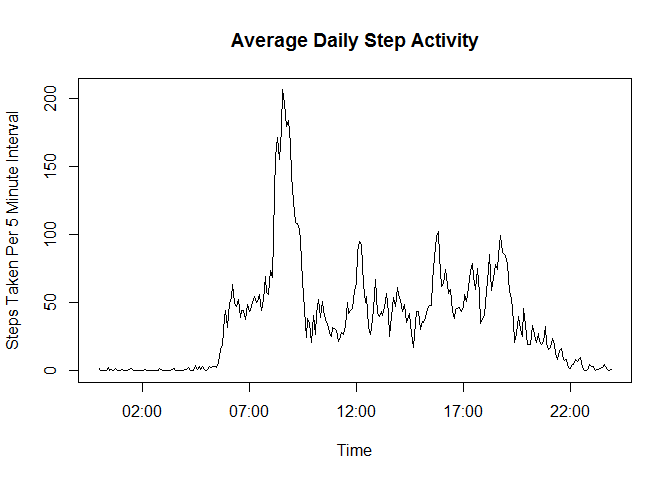

# Reproducible Research: Peer Assessment 1

## Setup environment
- packages required:  dplyr, ggplot2, and lubridate


```r
library(dplyr)
```

```
## 
## Attaching package: 'dplyr'
```

```
## The following objects are masked from 'package:stats':
## 
##     filter, lag
```

```
## The following objects are masked from 'package:base':
## 
##     intersect, setdiff, setequal, union
```

```r
library(ggplot2)
library(lubridate)
```

```
## 
## Attaching package: 'lubridate'
```

```
## The following object is masked from 'package:base':
## 
##     date
```

## Loading and preprocessing the data

The following list summarizes the preprocessing steps taken with the data set:

- Data obtained from https://github.com/rdpeng/RepData_PeerAssessment1 on 2017-01-10 at 9:30am.  

- Repository was forked, and downloaded locally. The source data is stored in activity.zip which contains the file activity.csv. The .csv file is extracted from the .zip, and then read into memory.

- The Date data column is converted into a date format.

- The interval column contains an integer representing the time.  This integer is in hhmm format.  A new column is added where the integer is converted into a POSIXct time as this is more suitable for graphing results.

- Day of the week and a weekday / weekend factor columns are added for use in the analysis.


```r
if (!file.exists("activity.csv")){
      print("retrieving activity from zip")
      unzip("activity.zip")
}
rawdata <- read.csv("activity.csv")
#summary(rawdata)
#str(rawdata)

# convert date column to date format
rawdata$date <- as.Date(rawdata$date, "%Y-%m-%d" )

# from interval time column, develop a Posix time column that
# can be used for graphs.
# first add leading zeros, break into hour and min, and combine to a Posix time
rawdata$timeTemp <- formatC(rawdata$interval, width=4, format="d", flag="0")
rawdata$timeHour <- substr(rawdata$timeTemp,1,2)
rawdata$timeMin <- substr(rawdata$timeTemp,3,4)
rawdata$timeCharF <- paste0(rawdata$timeHour,":",rawdata$timeMin)
rawdata$timeP <- as.POSIXct(rawdata$timeCharF, tz="UTC", format = "%H:%M")

#remove unnecessary columns
rawdata$timeTemp <- NULL
rawdata$timeHour <- NULL
rawdata$timeMin <- NULL

# add weekday / weekend factor
rawdata$day <- weekdays(rawdata$date,abbreviate=TRUE)
weekend <- c("Sat","Sun")
rawdata$weekend <- ifelse(rawdata$day %in% weekend, "Weekend", "Weekday")

# report back the basic info on the dataframe.
str(rawdata)
```

```
## 'data.frame':	17568 obs. of  7 variables:
##  $ steps    : int  NA NA NA NA NA NA NA NA NA NA ...
##  $ date     : Date, format: "2012-10-01" "2012-10-01" ...
##  $ interval : int  0 5 10 15 20 25 30 35 40 45 ...
##  $ timeCharF: chr  "00:00" "00:05" "00:10" "00:15" ...
##  $ timeP    : POSIXct, format: "2017-01-11 00:00:00" "2017-01-11 00:05:00" ...
##  $ day      : chr  "Mon" "Mon" "Mon" "Mon" ...
##  $ weekend  : chr  "Weekday" "Weekday" "Weekday" "Weekday" ...
```

--------------------
# Exploratory Analysis

## What is mean total number of steps taken per day?


```r
dailySteps <- summarise(group_by(rawdata, date), sum(steps, na.rm=TRUE))
colnames(dailySteps) <- c("Date","Sum")

meanDailySteps <- mean(dailySteps$Sum, na.rm=TRUE)
medianDailySteps <- median(dailySteps$Sum, na.rm=TRUE)
cat("For the sample period measuring the the client's activities, \n
the mean daily steps taken was ", as.integer(meanDailySteps), " steps per day, \n
with a median of ", medianDailySteps , "steps.")
```

```
## For the sample period measuring the the client's activities, 
## 
## the mean daily steps taken was  9354  steps per day, 
## 
## with a median of  10395 steps.
```

### Distribution of daily steps taken


```r
qplot(Sum, data=dailySteps, bins=8, col="red",
      main="Histogram of Total Daily Steps - 2 Month Sample",
      xlab="Sum of Steps Over Day",
      ylab="Count (days)")
```

<!-- -->

## What is the average daily activity pattern?


```r
dayPattern <- summarise(group_by(rawdata, timeP), 
                        mean(steps, na.rm=TRUE))
colnames(dayPattern) <- c("Time", "Mean")

with(dayPattern, plot(Time, Mean, type="l", 
                      main="Average Daily Step Activity",
                      ylab="Steps Taken Per 5 Minute Interval"))
```

<!-- -->


```r
sortedDayPattern <- arrange(dayPattern, desc(Mean))
cat("The peak daily activity period starts at: " ,
    strftime(sortedDayPattern$Time[1], format="%R", tz="UTC"),
    ", \nwith a mean of ", as.integer(sortedDayPattern$Mean[1]), " steps.")
```

```
## The peak daily activity period starts at:  08:35 , 
## with a mean of  206  steps.
```

## Imputing missing values

### Missing Values Review
From the above histogram it may be noted that there are 10 days with low and  potentially zero activity, which results in a bi-modal distribution in the histogram.  


```r
# Count the NA values
count <- sum(is.na(rawdata$steps))
cat("The dataset contains: ", count, "NA values, approximatly ",
    100*count/length(rawdata$steps), "% of the dataset.")
```

```
## The dataset contains:  2304 NA values, approximatly  13.11475 % of the dataset.
```

### Imputing Strategy

The imputing strategy used is to put the average value for the time period into any NA values.  This choice is based on the assumption that the subject follows a similar daily routine each day. 
In comparison, putting daily averages into NA values would show up as activity during the night which isn't so likely.


```r
imputePattern <- summarise(group_by(rawdata, interval), 
                        mean(steps, na.rm=TRUE))
colnames(imputePattern) <- c("Interval", "Mean")

# make new dataframe 'dataR2' for revised data
dataR2 <- rawdata

# replace NA values with average values for the same time period.
for (i in 1:nrow(dataR2)){
      if (is.na(dataR2[i, "steps"])){
            stime <- dataR2[i, "interval"]
            dataR2[i, "steps"] <-  imputePattern[imputePattern$Interval==stime,"Mean"]
      }
}

# recreate histogram presented earlier using the revised data set.
dailySteps2 <- summarise(group_by(dataR2, date), sum(steps, na.rm=TRUE))
colnames(dailySteps2) <- c("Date","Sum")

qplot(Sum, data=dailySteps2, bins=8, col="red",
      main="Daily Steps - 2 Month Sample - NA Values Adusted",
      xlab="Sum of Steps Over Day",
      ylab="Count (days)")
```

<!-- -->


```r
meanDailySteps2 <- mean(dailySteps2$Sum, na.rm=TRUE)
medianDailySteps2 <- median(dailySteps2$Sum, na.rm=TRUE)
cat("For the sample period measuring the the client's activities,",
      "\nthe mean daily steps taken was", as.integer(meanDailySteps2),
      "steps per day, \nwith a median of", 
      as.integer(medianDailySteps2) , "steps.")
```

```
## For the sample period measuring the the client's activities, 
## the mean daily steps taken was 10766 steps per day, 
## with a median of 10766 steps.
```

The imputed dataset no longer has the bimodal distribution resulting from days where data wasn't available.  The adjustment has increased the mean daily steps, such that it is now close to the median daily steps.

## Are there differences in activity patterns between weekdays and weekends?


```r
#summarize data with weekend factor included.
dayPattern2 <- summarise(group_by(dataR2, timeP, weekend), 
                        mean(steps, na.rm=TRUE))
colnames(dayPattern2) <- c("Time", "weekend", "Mean")
qplot(data=dayPattern2, Time, Mean, geom="line", facets=weekend~.)
```

<!-- -->

The subject appears to get up later on weekends, is a bit more active throughout the day, and stays up a bit later.  Interesting...


